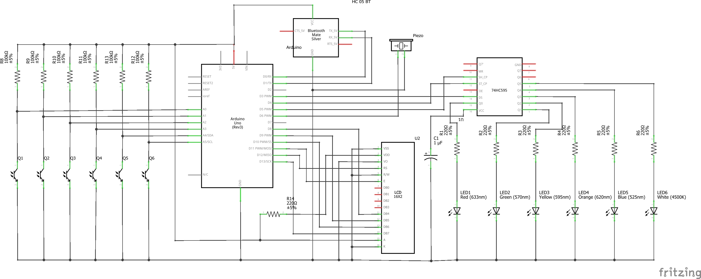

# Tilty Simon
Project to create a Simon Game with specifications for ITM 593 Embedded Systems

## Project overview
### Required for projct 
- 4 LED lights
- 4 Analog Force Sensitive resistors or potentiometers as input (or any other analog type of input
device)
o Use pressure as a threshold to consider a “button push”
- An LCD 16x2 Output Screen – for state messages
- A Piezo Buzzer for audio output
  - Give each “LED” a distinctive tone

- The connection indicator is the red image towards bottom

### Actual build components
- 6 LED lights
- 6 Photo transistors (Analog inputs)
- LCD screen
- Shift Register
- Piezo Buzzer
- Bluetooth module (HC-06)

### Game Play
- Start shows 3 screens to describe the game to the user
- Player must tilt another side up to signal start game
- The game pattern is shown to the user.
    - The user must tilt box according to pattern
    - Level 1-3 have a pattern of 3 to follow
    - Level 4-5 have pattern of 4 to follow with increasing difficulty
    - Difficulty increase means game pattern is shown faster, and time is shorter for player to move.
    - Score is kept and shown if player loses. 

### Materials
<!DOCTYPE html PUBLIC "-//W3C//DTD XHTML 1.0 Transitional//EN" "http://www.w3.org/TR/xhtml1/DTD/xhtml1-transitional.dtd">
<html xmlns="http://www.w3.org/1999/xhtml">
<head>
<meta http-equiv="Content-Type" content="text/html; charset=utf-8" />
<title>Fritzing Bill of Materials</title>

</head>

<body>
<h1>Bill of Materials: SimonTiltLight.fzz</h1>

C:/Users/KinectAcquisition2/Documents/GitHub/TiltySimon/TiltySimon/SimonTiltLight.fzz

Tuesday, February 26 2019, 15:32:02

<h2>Assembly List</h2>
<table>

  <thead>
   <tr>
    <th>Label</th>
    <th>Part Type</th>
    <th>Properties</th>
    </tr>
  </thead>
  <tbody>
  <tr>
    <td>Arduino</td>
    <td>Arduino Uno (Rev3)</td>
    <td class="props">type Arduino UNO (Rev3)</td>
</tr><tr>
    <td>HC 05 BT</td>
    <td>Bluetooth HC-05 Macho</td>
    <td class="props">variant variant 4; protocol Bluetooth</td>
</tr><tr>
    <td>LED1</td>
    <td>Red (633nm) LED</td>
    <td class="props">color Red (633nm); package 0603 [SMD]</td>
</tr><tr>
    <td>LED2</td>
    <td>Green (570nm) LED</td>
    <td class="props">color Green (570nm); package 0603 [SMD]</td>
</tr><tr>
    <td>LED3</td>
    <td>Yellow (595nm) LED</td>
    <td class="props">color Yellow (595nm); package 0603 [SMD]</td>
</tr><tr>
    <td>LED4</td>
    <td>Orange (620nm) LED</td>
    <td class="props">color Orange (620nm); package 0603 [SMD]</td>
</tr><tr>
    <td>LED5</td>
    <td>Blue (525nm) LED</td>
    <td class="props">color Blue (525nm); package 0603 [SMD]</td>
</tr><tr>
    <td>LED6</td>
    <td>White (4500K) LED</td>
    <td class="props">color White (4500K); package 0603 [SMD]</td>
</tr><tr>
    <td>Piezo</td>
    <td>Piezo Speaker</td>
    <td class="props"></td>
</tr><tr>
    <td>Q1</td>
    <td>LTR-301</td>
    <td class="props">features side-revceiving; package ltr-301</td>
</tr><tr>
    <td>Q2</td>
    <td>LTR-301</td>
    <td class="props">features side-revceiving; package ltr-301</td>
</tr><tr>
    <td>Q3</td>
    <td>LTR-301</td>
    <td class="props">features side-revceiving; package ltr-301</td>
</tr><tr>
    <td>Q4</td>
    <td>LTR-301</td>
    <td class="props">features side-revceiving; package ltr-301</td>
</tr><tr>
    <td>Q5</td>
    <td>LTR-301</td>
    <td class="props">features side-revceiving; package ltr-301</td>
</tr><tr>
    <td>Q6</td>
    <td>LTR-301</td>
    <td class="props">features side-revceiving; package ltr-301</td>
</tr><tr>
    <td>R1</td>
    <td>220Ω Resistor</td>
    <td class="props">tolerance ±5%; resistance 220Ω; package 0402 [SMD]</td>
</tr><tr>
    <td>R2</td>
    <td>220Ω Resistor</td>
    <td class="props">tolerance ±5%; resistance 220Ω; package 0402 [SMD]</td>
</tr><tr>
    <td>R3</td>
    <td>220Ω Resistor</td>
    <td class="props">tolerance ±5%; resistance 220Ω; package 0402 [SMD]</td>
</tr><tr>
    <td>R4</td>
    <td>220Ω Resistor</td>
    <td class="props">tolerance ±5%; resistance 220Ω; package 0402 [SMD]</td>
</tr><tr>
    <td>R5</td>
    <td>220Ω Resistor</td>
    <td class="props">tolerance ±5%; resistance 220Ω; package 0402 [SMD]</td>
</tr><tr>
    <td>R6</td>
    <td>220Ω Resistor</td>
    <td class="props">tolerance ±5%; resistance 220Ω; package 0402 [SMD]</td>
</tr><tr>
    <td>R8</td>
    <td>100kΩ Resistor</td>
    <td class="props">tolerance ±5%; resistance 100kΩ; package 0402 [SMD]</td>
</tr><tr>
    <td>R9</td>
    <td>100kΩ Resistor</td>
    <td class="props">tolerance ±5%; resistance 100kΩ; package 0402 [SMD]</td>
</tr><tr>
    <td>R10</td>
    <td>100kΩ Resistor</td>
    <td class="props">tolerance ±5%; resistance 100kΩ; package 0402 [SMD]</td>
</tr><tr>
    <td>R11</td>
    <td>100kΩ Resistor</td>
    <td class="props">tolerance ±5%; resistance 100kΩ; package 0402 [SMD]</td>
</tr><tr>
    <td>R12</td>
    <td>100kΩ Resistor</td>
    <td class="props">tolerance ±5%; resistance 100kΩ; package 0402 [SMD]</td>
</tr><tr>
    <td>R13</td>
    <td>100kΩ Resistor</td>
    <td class="props">tolerance ±5%; resistance 100kΩ; package 0402 [SMD]</td>
</tr><tr>
    <td>R14</td>
    <td>220Ω Resistor</td>
    <td class="props">tolerance ±5%; resistance 220Ω; package 0603 [SMD]</td>
</tr><tr>
    <td>U1</td>
    <td>74HC595 SMD</td>
    <td class="props">logic family 74xx; package SO16 [SMD]</td>
</tr><tr>
    <td>U2</td>
    <td>LCD-16X2</td>
    <td class="props">variant silk; package lcd-16x2; characters 16x2</td>
</tr>
  </tbody>
</table>
<h2>Shopping List</h2>
<table>
  <thead>
	<tr>
    <th>Amount</th>
    <th>Part Type</th>
    <th>Properties</th>
    </tr>
  </thead>
  <tbody>
<tr>
    <td>1</td>
    <td>Arduino Uno (Rev3)</td>
    <td class="props">type Arduino UNO (Rev3)</td>
</tr><tr>
    <td>1</td>
    <td>Bluetooth HC-05 Macho</td>
    <td class="props">variant variant 4; protocol Bluetooth</td>
</tr><tr>
    <td>1</td>
    <td>Red (633nm) LED</td>
    <td class="props">color Red (633nm); package 0603 [SMD]</td>
</tr><tr>
    <td>1</td>
    <td>Green (570nm) LED</td>
    <td class="props">color Green (570nm); package 0603 [SMD]</td>
</tr><tr>
    <td>1</td>
    <td>Yellow (595nm) LED</td>
    <td class="props">color Yellow (595nm); package 0603 [SMD]</td>
</tr><tr>
    <td>1</td>
    <td>Orange (620nm) LED</td>
    <td class="props">color Orange (620nm); package 0603 [SMD]</td>
</tr><tr>
    <td>1</td>
    <td>Blue (525nm) LED</td>
    <td class="props">color Blue (525nm); package 0603 [SMD]</td>
</tr><tr>
    <td>1</td>
    <td>White (4500K) LED</td>
    <td class="props">color White (4500K); package 0603 [SMD]</td>
</tr><tr>
    <td>1</td>
    <td>Piezo Speaker</td>
    <td class="props"></td>
</tr><tr>
    <td>6</td>
    <td>LTR-301</td>
    <td class="props">features side-revceiving; package ltr-301</td>
</tr><tr>
    <td>6</td>
    <td>220Ω Resistor</td>
    <td class="props">tolerance ±5%; resistance 220Ω; package 0402 [SMD]</td>
</tr><tr>
    <td>6</td>
    <td>100kΩ Resistor</td>
    <td class="props">tolerance ±5%; resistance 100kΩ; package 0402 [SMD]</td>
</tr><tr>
    <td>1</td>
    <td>220Ω Resistor</td>
    <td class="props">tolerance ±5%; resistance 220Ω; package 0603 [SMD]</td>
</tr><tr>
    <td>1</td>
    <td>74HC595 SMD</td>
    <td class="props">logic family 74xx; package SO16 [SMD]</td>
</tr><tr>
    <td>1</td>
    <td>LCD-16X2</td>
    <td class="props">variant silk; package lcd-16x2; characters 16x2</td>
</tr>
  </tbody>
</table>

 Exported with Fritzing 0.9.3- http://fritzing.org

</body>
</html>

### Bluetooth
 Bluetooth module is connect and currently outputs debug statements , but can be used for player controls or game views in future development. 

## KNOWN ISSUES
> - Needs to be played on flat surface
> - Can not be played in the dark
> - Hand placement can cause lose state by error
